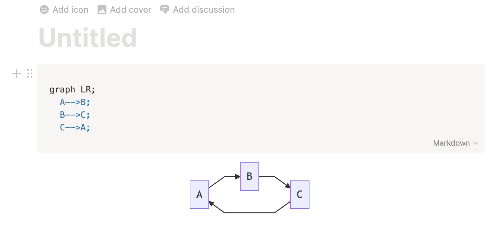
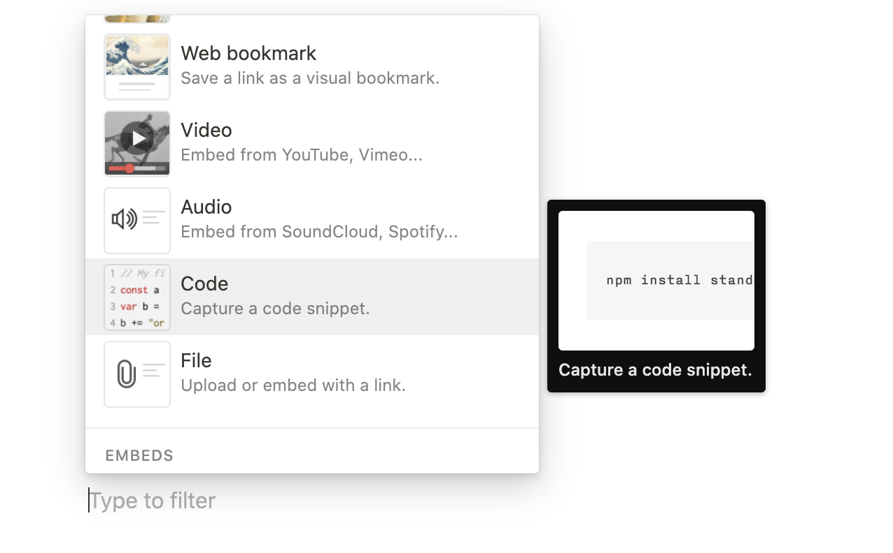
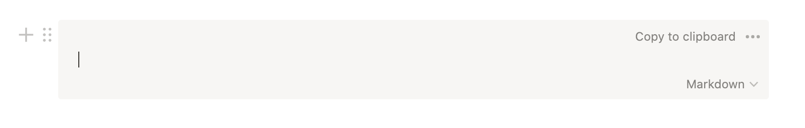
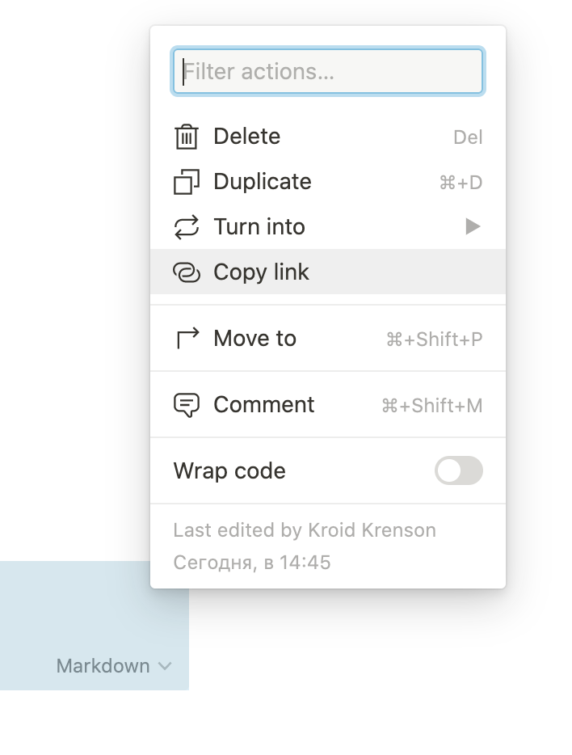
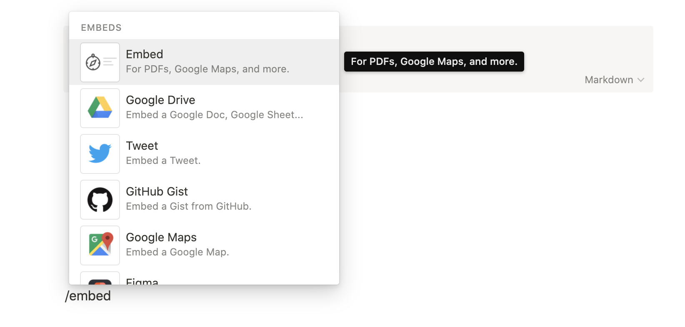
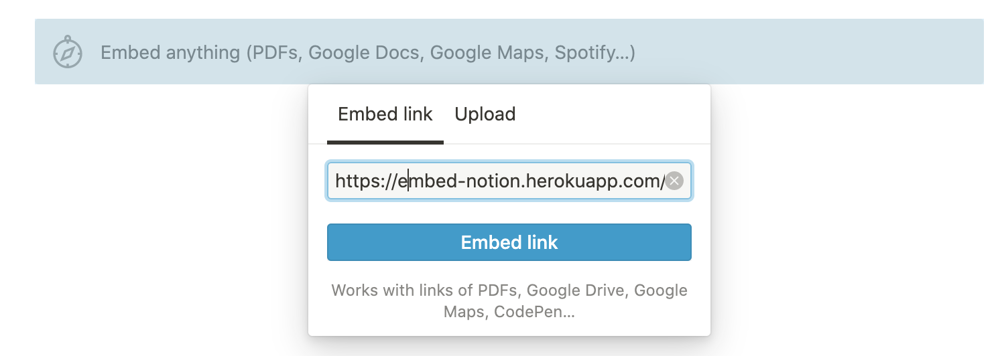

# Embed Notion

Web server for notion embed components. With this, you can use additional features, like flowcharts, diagrams, etc.



## Available libraries:

- [mermaid.js](https://github.com/mermaid-js/mermaid)

## How to

1. Get your notion token. More information here: https://github.com/dragonman225/notionapi-agent/blob/master/documentation/get-token/get-token.md
2. Create notion's code element:
   
3. Set markdown language:
   
4. Copy block id of element:
   
   For example, for url:
   `https://www.notion.so/2fde7f36cbe67a59bab4598af323b0c6#1fa438a1c04a42c28a809cc826a8f20b` block id is `1fa438a1c04a42c28a809cc826a8f20b`
5. Go to website, submit token with block id, copy url and past it to notion embed:
   

   

6. After updated content in your markdown block, double click on embed component and it will reloaded.

## Self hosted

If you use this on your onw server, you need environment variables:

```
ENCRYPTION_KEY=string of 32 characters
NOTION_TOKEN=if you set notion token, you not need to submit it every time
NODE_ENV=production
```
